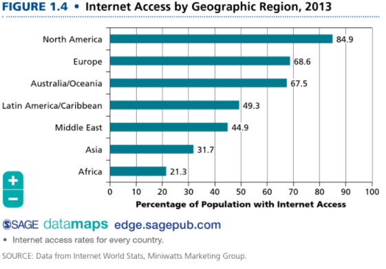

# **Central concerns for a 21 century sociology**

# Globalization 

We are living in the "global age" (Albrow 1996). Society is a complex pattern of social relationships that is bounded in space and persists over time, has traditionally been the largest unit of analysis in sociology. The transnational structures are becoming more important than individual societies. Why? For example, OPEC is more important to the rest of the world's well-being than are the organization's key member societies, such as Abu Dhabi or even Saudi Arabia.

## Social fluid

People are more "fluid". That is, they move farther, more easily, and more quickly than ever before. The movement of products of all types is also more fluid as as result of the existence of massive container ships, cargo jets, and package delivery services such as FedEx and UPS. 

## Social structure expedited or impede the fluid

These flows can be expedited (/ˈekspəˌdīt/ speed up) by structures of various types. For example, the EU is an example of a social structure that serves to ease the flow of citizens among member nations. There are also structure that impede various kinds of global flows. For example, national borders, passports and passport controls.

In sum, **globalization** is defined by increasingly fluid global flows and the structures and the social structure expedited or impede the fluid. 

# Consumption

Beginning in the 1950s, another major social change took place in the US and other developed countries. The central feature of many capitalist economies began to shift from production and work to **consumption**, or the process by which people obtain and utilize goods and services. 

## Economical

For example, a good example is the iPhone, which has revolutionized culture in innumerable ways. Consumption and globalization are also deeply intertwined. Much of what we consume in the developed world comes from other countries. For example, the US imported $440 billion worth of good from China. Tourists is often the sampling of the foods of foreign lands, as well as the purchase of souvenirs.

## McDonaldization

- *Efficiency*. 
- *Calculability*.
- *Predictability*.
- *Control*

## Critiquing Consumption

A critical look at the ways in which they are structured. These sites may be set up to lead people to consume certain things and not others, to consume more than they might have intended, and to go into debt. Sociologists are also interested in how consumers use shopping malls and e0tailers in ways that were no t anticipated by their designers. For example, shoppers wader through shopping malls and their many shops, which have been designed to spur consumption, without buying anything. 

# The digital world

Sociology has always concerned itself with the social aspects and implications of **technology**, or the interplay of machines, tools, skills, and procedures for the accomplishment of tasks. Sociologists are devoting an increasing amount of attention to the digital world that has emerged as a result of new technologies already mentioned in this chapter, such as computers, smartphones, the Internet, and social networking sites. 

## Intersecting and augmenting

Two forms of the living are increasingly intersecting and augmenting each other. This is specially important in NA, where the percentage of the population with access to the Internet is highest. While social networking sites can bring about greater interaction, they also come between people and affect the nature of interaction. For example, Twitter limits each message to 140 chars, but face-to-face communication has no such limits. On the other hand, face-to-face communication is limited to a shared physical space.

## Mediated Interaction

Technology such as the Internet and the smartphone comes between the people who are communicating, while there is no such interference in nonmedicated interaction. People who are shy and insecure when it comes to dating or sex, for example, may be much more comfortable relating to others on mediated websites. People also spend **more time** on the media. We also **multitask** among serval online and offline interactions simultaneously, such as in class or while doing homework. Internet also affects the nature of consumption. More of it is taking place on such sites as **eBay and Amazon**. 

# Globalization, consumption, the digital world, and you

- You live a truly global existence in a college or university. 
- As consumers, you and your classmates are likely well acquainted with college bookstore another nearby shopping mall.
- An increasing portion of your education is obtained through the inherently global Internet.

# **Sociology: continuity and change**

This chapter has emphasized recent social changes and their impact on society and on sociology, but there is also much continuity in society , as well as in the field of sociology. 

# Sociological Imagination

Social world study has always required **imagination** of he part of sociologists. For example, "war on Terror" might look defensible from the perspective of an American, especially one who live thorough 9/11, but it would look quite different if you imagined yourself in the place of an innocent Muslim caught in the middle of that war. The **sociology imagination** that gives a distinctive sociological, rather than personal, way of looking at data or reflecting on the world around them. 

## Private troubles and public issues

The sociology imagination may be most useful in helping sociologists see the linkage between private troubles and public issues. For example, the Great Recession would be useful in alerting society to the fact that the increasing levels of individual consumption and debt, seen at the time as private issues, would soon morph into a public issue.

## The micro-macro relationship

The interest in personal troubles and public issues in a specific  example of a larger and more basic sociological concern with the relationship between microscopic social phenomena, and macroscopic social phenomena, such as groups, organizations, cultures, society, and the world, as well as the relationships among them. 

## The agency-structure relationship

It highlights serval important social realities and aspects of the field of sociology. 

# The social construction of reality

The discussion of agency and structure leads to another basic concept in sociology: **the social construction of reality**. For example, in the realm of consumption, it is people as designers, manufactures, consumers, and bloggers-who create the world o fashion. 

## Social structures and processes

The social structures are enduring and regular social arrangements, such as the family and the state. When social structures change, they change very slowly. Social processes are the dynamic and ever0changing aspects of the social world. 

# **Sociology's purpose: science or social reform?**

Comet was famous not only for examine the relationship between structure and process but also for arguing that such study ought to be scientific. He believed that the social world was dominated by laws and that sociology's task was to uncover those laws. 

# **Sociology, the other social sciences, and common sense**

Sociology is one of the social sciences-that is, its is one of the fields that studies various aspects of the social world.